# Application Architecture & Technology Document: RFCBuddy - RFC Buddy

This document provides a comprehensive blueprint and technology assessment of **RFC Buddy (RFCBuddy)**. It is designed to be maintained, verified, and parsed by the Architecture Review Agent to ensure architectural standards, security policies, and technical currency are continuously verified.

---

## Revision History

| Version | Date | Author | Changes |
| :--- | :--- | :--- | :--- |
| `1.0` | `2026-07-30` | `Architecture Review Agent` | `Initial architecture documentation generation based on codebase inspection and workspace analysis.` |

---

## 1. Metadata & Organizational Alignment

| Metadata Field | Value / Description | Confidence |
| :--- | :--- | :--- |
| **Application Acronym** | `RFCBuddy` | Verified (`RfcBuddy.sln`, `appsettings.json`) |
| **Full Application Name** | `RFC Buddy - OCIO 365-Day Schedule Filter & CAB Document Generator` | Verified (`README.md`, `specs/001-recent-completed-rfcs/spec.md`) |
| **Status** | `Active` | Verified (`README.md` lifecycle badge: Stable) |
| **Ministry** | `Ministry of Citizens' Services` | Inferred (`dev_values.yaml` - BC Gov DevOps Emerald Cluster) |
| **Division** | `Office of the Chief Information Officer (OCIO)` | Verified (`README.md`) |

---

## 2. System Overview & Boundaries

### 2.1 Capability Statement
RFC Buddy processes the daily 365-day change schedule published by the OCIO, applying custom filters and highlights based on user-defined keyword areas (Ministry, General, Ignore). It automatically tracks change history against a baseline, preserves a 5-week completed RFC archive, and generates pre-formatted Word (.docx) documents for Change Advisory Board (CAB) meetings. Additionally, it provides a PAT-authenticated REST API (`/api/v1/rfcs/search`) for automated downstream integrations.

### 2.2 System Context Diagram

```mermaid
graph TD
    CABUser([CAB Reviewer / User]) -->|HTTPS / OIDC| WebUI[RFC Buddy Web Application]
    DownstreamApp([Downstream System / CLI]) -->|HTTPS / Bearer PAT| RestAPI[REST API /api/v1/rfcs]
    WebUI -->|OIDC / Auth Code + PAR| Keycloak[Keycloak Identity Provider]
    WebUI -->|HTTP Download| OCIOSchedule[OCIO 365-Day Schedule Excel Source]
    WebUI -->|Read/Write| DataVol[(Shared Persistent Volume /app/data)]
    RestAPI -->|Read/Write| DataVol
    
    subgraph DataVol [/app/data Volume]
        UsersStore[users.json]
        TokensStore[apitokens.json]
        UserBaselines[{userId}/PreviousRFCs.txt]
        ArchiveStore[archive.json]
        DataProtectionKeys[keys/* DataProtection Key Ring]
    end
```

---

## 3. Logical & Structural Component Breakdown

```
src/
├── RfcBuddy.App/                 # Core Domain & Application Logic (.NET 10 Class Library)
│   ├── Core/                     # Cryptography (SHA256) & DateTime Extensions (Pacific Time)
│   ├── Objects/                  # Domain Models (Rfc, ApiToken, UserRecord, AppSettings, etc.)
│   └── Services/                 # Business Services (ApiToken, UserRegistry, Excel, Word, Archive, ChangeTracker)
├── RfcBuddy.App.Tests/           # Unit Tests for Domain Services & Core Logic
├── RfcBuddy.Web/                 # ASP.NET Core MVC & REST API Web Host (.NET 10 Web App)
│   ├── Authentication/           # ApiTokenAuthenticationHandler (Bearer token auth & side-channel delay)
│   ├── Authorization/            # AdminRequirement & AdminAuthorizationHandler
│   ├── Controllers/              # HomeController, RfcApiController, ApiTokensController, AdminController
│   ├── Models/                   # ViewModels & API DTOs (RfcSearchRequest, RfcSearchResponse)
│   ├── Services/                 # Hosted Background Services (ArchiveUpdateService, UserMaintenanceService)
│   ├── Support/                  # UserRegistrationFilter, AppVersion
│   └── Program.cs                # Dependency Injection, Middleware, Auth & DataProtection Setup
└── RfcBuddy.Web.Tests/           # Integration & Controller Tests
```

### 3.1 Key Architecture Seams

* **Cluster 1: Authentication & Token Management (`ApiTokenService`, `ApiTokenAuthenticationHandler`, `ApiTokensController`)**
  * *Key Components:* `src/RfcBuddy.App/Services/ApiTokenService.cs`, `src/RfcBuddy.Web/Authentication/ApiTokenAuthenticationHandler.cs`, `src/RfcBuddy.Web/Controllers/ApiTokensController.cs`
  * *Purpose:* Issues, authenticates, and revokes Personal Access Tokens (PATs) using SHA-256 token hashing and side-channel timing defenses.
* **Cluster 2: RFC Processing & Word Document Generation (`ExcelService`, `WordService`, `RfcArchiveService`, `RfcChangeTracker`)**
  * *Key Components:* `src/RfcBuddy.App/Services/ExcelService.cs`, `src/RfcBuddy.App/Services/WordService.cs`, `src/RfcBuddy.App/Services/RfcArchiveService.cs`, `src/RfcBuddy.App/Services/RfcChangeTracker.cs`
  * *Purpose:* Downloads the OCIO Excel schedule, categorizes RFCs, tracks baseline differences, maintains the 5-week completed archive, and generates OpenXML `.docx` files.
* **Cluster 3: User Registry & Administration (`UserRegistryService`, `AdminController`, `UserRegistrationFilter`)**
  * *Key Components:* `src/RfcBuddy.App/Services/UserRegistryService.cs`, `src/RfcBuddy.Web/Controllers/AdminController.cs`, `src/RfcBuddy.Web/Support/UserRegistrationFilter.cs`
  * *Purpose:* Manages user onboarding, auto-promotes the first interactive user to administrator, enforces RBAC, and purges inactive user accounts.
* **Cluster 4: Automated Background Operations (`ArchiveUpdateService`, `UserMaintenanceService`)**
  * *Key Components:* `src/RfcBuddy.Web/Services/ArchiveUpdateService.cs`, `src/RfcBuddy.Web/Services/UserMaintenanceService.cs`
  * *Purpose:* Hosted background services (`IHostedService`) that automatically update/prune the RFC archive weekly and clean up inactive user data daily.

### 3.2 Entry Points & Gateways

| Entry Point | Type | Path / Reference | Confidence |
| :--- | :--- | :--- | :--- |
| **Web UI Home** | `MVC Controller` | `GET /`, `POST /` (`HomeController.Index`) | Verified |
| **PAT Management UI** | `MVC Controller` | `GET/POST /ApiTokens`, `GET/POST /ApiTokens/Create`, `POST /ApiTokens/Revoke` | Verified |
| **Admin Panel UI** | `MVC Controller` | `GET /Admin`, `POST /Admin/SetAdmin`, `POST /Admin/RevokeToken` | Verified |
| **REST API Search** | `REST API` | `POST /api/v1/rfcs/search` (`RfcApiController.Search`) | Verified |
| **Health Check Probe** | `HTTP Endpoint` | `GET /healthz` | Verified |
| **Archive Auto-Update** | `Background Worker` | `ArchiveUpdateService` (Hosted Service, hourly check, 7-day refresh interval) | Verified |
| **User Cleanup Worker** | `Background Worker` | `UserMaintenanceService` (Hosted Service, 6-hour interval) | Verified |

---

## 4. API Surface & Contracts

### 4.1 API Versioning Strategy

| API Version | Status | Base Path / Header | Sunset Date | Confidence |
| :--- | :--- | :--- | :--- | :--- |
| `v1` | `Active` | `/api/v1/rfcs` | N/A | Verified |

### 4.2 Contract Documentation

| Contract Type | Location | Auto-Generated | Confidence |
| :--- | :--- | :--- | :--- |
| `REST API Spec` | `specs/002-rest-api-pat-auth/contracts/rest-api.md` | `No` | Verified |
| `Service Contracts` | `specs/002-rest-api-pat-auth/contracts/service-contracts.md` | `No` | Verified |

### 4.3 Contract Testing
Unit and integration tests in `src/RfcBuddy.Web.Tests/Controllers/RfcApiControllerTests.cs` and `src/RfcBuddy.Web.Tests/Authentication/ApiTokenAuthenticationHandlerTests.cs` validate request/response JSON models, error handling, token authentication, and status returns.

---

## 7. Security Architecture

### 7.1 Authentication & Authorization Model

| Aspect | Implementation | Confidence |
| :--- | :--- | :--- |
| **Authentication Method** | `OIDC (Web UI) / Bearer PAT (REST API)` | Verified |
| **Identity Provider** | `Keycloak` (BC Gov DevHub / Gold Keycloak) | Verified |
| **Authorization Model** | `RBAC / Policy-based` (`Admin` policy via `AdminRequirement` & `AdminAuthorizationHandler`) | Verified |
| **Token Format** | `Session Cookie (Web) / Raw String 64-char Hex (PAT)` | Verified |
| **Token Storage** | `HttpOnly Cookie (Web) / SHA-256 Hashed JSON Store (PAT)` | Verified |

### 7.2 Cryptographic Controls
- **Secret Generation:** Raw PATs are generated using `Guid.NewGuid().ToString("N") + ":" + Guid.NewGuid().ToString("N")` yielding 64 alphanumeric characters.
- **Transience of Secrets:** Raw PAT strings are displayed ONCE upon creation (`TempData["CreatedToken"]`) and never stored. Only SHA-256 hashes (`Cryptography.GetSha256Hash`) are persisted in `apitokens.json`.
- **Credential Storage:** User identities and tokens are stored in `/app/data/users.json` and `/app/data/apitokens.json`. No raw credentials or passwords are created or stored by the application (authentication is delegated to Keycloak OIDC).
- **Side-Channel Mitigation:** `ApiTokenAuthenticationHandler` implements an explicit `Task.Delay(100)` delay on authentication failure responses to normalize execution timing and mitigate timing attacks.

### 7.3 Concurrency & Data Integrity
- **Lock Granularity:** Process-wide named cross-thread `System.Threading.Mutex` instances (`Global\RfcBuddyTokens_*` and `Global\RfcBuddyUsers_*`) lock store file updates.
- **Race Condition Prevention:** File modifications use an atomic write-and-replace strategy: JSON data is written to a unique temporary file (`.tmp-{guid}`) and atomically moved (`File.Move(tempPath, storePath, true)`) to prevent corrupted reads during concurrent operations.
- **Multi-Replica Session Consistency:** DataProtection keys are persisted to a shared volume directory (`/app/data/keys`) using `.PersistKeysToFileSystem()` with a unified application name (`SetApplicationName("RfcBuddy")`), ensuring cross-pod cookie decryption and anti-forgery token consistency across OpenShift replicas.

### 7.4 Audit & Logging
- **Structured Audit Events:** Security-relevant operations (token creation, token revocation, admin role changes, user account purges) log structured entries via `ILogger`.
- **PII Redaction:** User identifiers in stores are sanitized or hashed (`Cryptography.GetSha256Hash(User.Identity.Name)`). No cleartext tokens or secrets are logged.

### 7.5 Data Classification

| Data Category | Classification | Encryption at Rest | Encryption in Transit | Retention Policy | Confidence |
| :--- | :--- | :--- | :--- | :--- | :--- |
| **RFC Schedule Data** | `Internal` | Persistent Volume Storage | `TLS 1.2+` | Archived up to 35 days (5 weeks) | Verified |
| **User & Token Metadata** | `Confidential` | Persistent Volume / SHA-256 Hash | `TLS 1.2+` | Retained until revoked or purged after inactivity threshold | Verified |

---

## 8. Deployment & Infrastructure

### 8.1 Environment Topology

| Environment | Purpose | Hosting | URL / Endpoint | Confidence |
| :--- | :--- | :--- | :--- | :--- |
| **Development** | Feature testing | OpenShift Emerald | `https://rfcbuddy-ca61f6-dev.apps.emerald.devops.gov.bc.ca` | Verified |
| **Test / QA** | Integration testing | OpenShift Emerald | Managed via `tenant-gitops-ca61f6` (`test_values.yaml`) | Verified |
| **Production** | Live workload | OpenShift Emerald | `https://rfcbuddy-ca61f6-prod.apps.emerald.devops.gov.bc.ca` | Verified |

### 8.2 CI/CD Pipeline

```mermaid
graph LR
    Commit[Git Push / PR] --> CI[GitHub Actions dotnet-10-ci.yml]
    CI --> Restore[dotnet restore --locked-mode]
    Restore --> Lint[dotnet format --verify-no-changes]
    Lint --> Build[dotnet build -c Release]
    Build --> Test[dotnet test & Coverlet Coverage]
    Test --> DockerBuild[Docker Buildx & ghcr.io Publish]
    DockerBuild --> GitOps[GitOps Deployment tenant-gitops-ca61f6]
    GitOps --> OpenShift[OpenShift Cluster Emerald]
```



| Pipeline Aspect | Details | Confidence |
| :--- | :--- | :--- |
| **CI Platform** | `GitHub Actions` (`.github/workflows/dotnet-10-ci.yml`) | Verified |
| **Artifact Registry** | `GitHub Container Registry` (`ghcr.io/bcgov/rfcbuddy`) | Verified |
| **Deployment Strategy** | `GitOps / Rolling Update` (2 replicas in Dev & Prod) | Verified |
| **Infrastructure-as-Code** | `Helm Charts & GitOps` (`tenant-gitops-ca61f6`) | Verified |

### 8.3 Container & Orchestration

| Aspect | Details | Confidence |
| :--- | :--- | :--- |
| **Container Runtime** | `Docker / OCI` | Verified |
| **Base Image** | `mcr.microsoft.com/dotnet/aspnet:10.0` (SDK: `mcr.microsoft.com/dotnet/sdk:10.0`) | Verified |
| **Orchestration** | `OpenShift / Kubernetes` | Verified |
| **Security Context** | Non-privileged user `USER 1001` in Dockerfile | Verified |
| **Network Policy** | OpenShift Egress Network Policies restricting port 8080 (F5 Proxy) and port 443 (Keycloak) | Verified |

---

## 9. Observability

### 9.1 Logging
| Aspect | Details | Confidence |
| :--- | :--- | :--- |
| **Framework** | `Microsoft.Extensions.Logging` (`ILogger`) | Verified |
| **Aggregation** | `OpenShift / Console stdout` | Verified |
| **Structured Format** | `Console Log / Plaintext & JSON` | Verified |
| **Correlation ID** | `Activity.Current?.Id ?? HttpContext.TraceIdentifier` | Verified |

### 9.2 Metrics & Monitoring
| Aspect | Details | Confidence |
| :--- | :--- | :--- |
| **Metrics Library** | ASP.NET Core Built-in Metrics | Verified |
| **Dashboard** | OpenShift Cluster Monitoring / Grafana | Inferred |

### 9.3 Health Checks & Alerts
| Endpoint / Check | Purpose | Alert Threshold | Confidence |
| :--- | :--- | :--- | :--- |
| `/healthz` | OpenShift Liveness & Readiness Probe (`AllowAnonymous`) | Unhealthy on process failure or unhandled startup crash | Verified |

---

## 10. Resilience & Disaster Recovery

| Aspect | Details | Confidence |
| :--- | :--- | :--- |
| **RTO (Recovery Time Objective)** | `< 5 minutes` (Pod redeployment via OpenShift deployment) | Inferred |
| **RPO (Recovery Point Objective)** | `< 24 hours` (Persisted user settings & tokens on PVC) | Inferred |
| **Backup Strategy** | OpenShift PVC Snapshots (`1Gi` PersistentVolumeClaim) | Verified |
| **Failover Mechanism** | Active-Active multi-pod deployment (2 replicas with shared DataProtection key ring) | Verified |
| **Graceful Degradation** | Catch-up execution on application startup for background tasks; user-facing error bounds for archive limits | Verified |

---

## 11. Architecture Decision Records (ADRs)

| ADR / Spec ID | Title / Theme | Status | Date | Reference | Confidence |
| :--- | :--- | :--- | :--- | :--- | :--- |
| `001` | Recent Completed RFCs & App Version Display | `Completed` | `2026-06-30` | `specs/001-recent-completed-rfcs/spec.md` | Verified |
| `002` | REST API and PAT Authentication | `Completed` | `2026-07-02` | `specs/002-rest-api-pat-auth/spec.md` | Verified |

---

## 12. Architecture Review Agent Verification & Compliance Checklist

### Confidence Legend
- **Verified** — Confirmed by direct evidence in source code or configuration.
- **Inferred** — Deduced from directory structure, naming conventions, or partial evidence.
- **Unknown** — Could not be determined; requires manual review.
- **N/A** — Not applicable to this application's architecture.

### Checklist

- [x] **Technical Currency:** All core runtimes (.NET 10.0) and dependencies are within active support phases. No EOL platforms in production. `[Confidence: Verified]`
- [x] **No Hardcoded Credentials:** Zero secret or token literals exist in source code commits; Keycloak client secrets and proxy details are injected via environment variables/secrets (`appsettings.json` placeholders `$(appSetting-*)`). `[Confidence: Verified]`
- [x] **Cryptographic Controls:** Raw tokens are 64-char random GUID strings; only SHA-256 hashes are persisted. `[Confidence: Verified]`
- [x] **Side-Channel Defenses:** `ApiTokenAuthenticationHandler` enforces a `Task.Delay(100)` delay on authentication rejection paths to prevent timing attacks. `[Confidence: Verified]`
- [x] **Audit Logging:** Structured logging enabled across controllers, services, and background workers. `[Confidence: Verified]`
- [x] **Concurrency Safety:** Named process-wide `Mutex` instances and atomic temporary file replacement (`.tmp-{guid}` -> move) prevent store corruption under concurrent access. Multi-pod DataProtection key ring shared via PVC. `[Confidence: Verified]`
- [x] **Dependency Health:** Locked dependencies via `packages.lock.json` and `--locked-mode` in CI. `[Confidence: Verified]`
- [x] **Observability:** `/healthz` endpoint configured and exposed for OpenShift probes. `[Confidence: Verified]`
- [x] **Deployment Pipeline:** GitHub Actions CI includes formatting verification, unit tests, code coverage, Docker builds, and GitOps deployment. `[Confidence: Verified]`
- [x] **Data Classification:** Classified as Medium DataClass (`podLabels.DataClass: Medium`) with TLS 1.2+ in transit and PVC persistence. `[Confidence: Verified]`
- [x] **Disaster Recovery:** Persistent volume claim (`1Gi`) retains configuration, user baselines, tokens, and DataProtection key ring across pod restarts. `[Confidence: Verified]`
