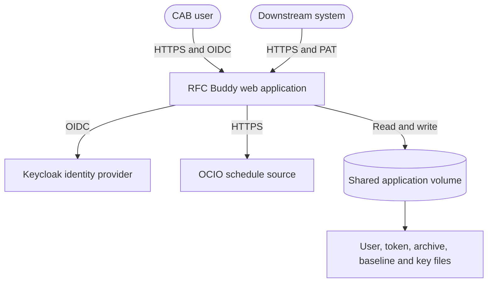
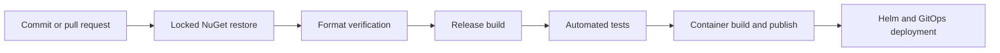

# Application Architecture & Technology Document: RFCBuddy - RFC Buddy

This document records the observed architecture, security boundaries, deployment shape, and evidence gaps for RFC Buddy.

---

## Revision History

| Version | Date | Author | Changes |
| :--- | :--- | :--- | :--- |
| `1.0` | `2026-07-30` | `Architecture Review Agent` | `Initial architecture documentation.` |
| `1.1` | `2026-09-11` | `Architecture Review Agent` | `Updated topology, dependency and container evidence; added Unicode, contract degradation, platform alignment, and Zero Trust assessments.` |
| `1.2` | `2026-09-11` | `Architecture Review Agent` | `Recorded canonical public environment URLs and clarified that local development settings are excluded by the nested project ignore file.` |

---

## 1. Metadata & Organizational Alignment

| Metadata Field | Value / Description |
| :--- | :--- |
| **Application Acronym** | `RFCBuddy` |
| **Full Application Name** | `RFC Buddy - OCIO 365-Day Schedule Filter & CAB Document Generator` |
| **Status** | `Active` |
| **Ministry** | `Ministry of Citizens' Services` (inferred from deployment metadata) |
| **Division** | `Office of the Chief Information Officer (OCIO)` |

---

## 2. System Overview & Boundaries

### 2.1 Capability Statement

RFC Buddy retrieves the OCIO 365-day change schedule, applies user-defined keyword filters, tracks changes against per-user baselines, maintains a completed RFC archive, and generates CAB Word documents. Authenticated browser users manage filters and API tokens through the MVC application, while downstream systems use the versioned PAT-authenticated search endpoint.

### 2.2 System Context Diagram



### 2.3 Platform role, reuse, and data responsibility

| Assessment | Result | Evidence / Owner | Confidence |
| :--- | :--- | :--- | :--- |
| **Conditional role** | `Point solution with integration-adapter aspect` | Consumes the OCIO schedule and exposes a downstream API; application team owns the implementation. | `Inferred` |
| **One-to-many impact** | `Multiple consumers` | Versioned `/api/v1/rfcs/search` endpoint is intended for downstream systems. | `Verified` |
| **Reuse or build decision** | `No shared catalogue or reusable service was evidenced; preserve the existing point solution pending owner review.` | `README.md`, solution structure and deployment workspace. | `Unknown` |
| **Data custodian and permitted purpose/subject scope** | `OCIO appears to own the source schedule; formal permitted-use scope is not documented.` | Source URL configuration and application purpose. | `Unknown` |
| **Data sharing spectrum** | `Shared/Internal` | Authenticated UI and PAT API; no public data boundary was evidenced. | `Unknown` |
| **Narrow question API vs. broad data access** | `The API exposes filtered RFC search results; consumer limits and capacity expectations are not documented.` | REST contract under `specs/002-rest-api-pat-auth/contracts`. | `Inferred` |

---

## 3. Logical & Structural Component Breakdown

```text
src/
|- RfcBuddy.App/                 # Domain models and application services
|  |- Core/                      # Hashing and date/time helpers
|  |- Objects/                   # Domain models and settings
|  `- Services/                  # Schedule, archive, token and user services
|- RfcBuddy.Web/                 # ASP.NET Core MVC host and REST API
|  |- Authentication/            # PAT authentication handler
|  |- Authorization/             # Admin policy and handler
|  |- Controllers/               # MVC and API entry points
|  |- Services/                  # Hosted background services
|  `- Program.cs                 # DI, middleware, auth and data protection
|- RfcBuddy.App.Tests/           # Application unit tests
`- RfcBuddy.Web.Tests/           # Web and controller tests
```

### 3.1 Key Architecture Seams

* **Authentication and token management:** `ApiTokenService`, `ApiTokenAuthenticationHandler`, and `ApiTokensController` issue, hash, authenticate, and revoke PATs.
* **RFC processing and document generation:** `ExcelService`, `RfcArchiveService`, `RfcChangeTracker`, and `WordService` retrieve, filter, persist, and export schedule data.
* **User registry and administration:** `UserRegistryService`, `UserRegistrationFilter`, and `AdminController` maintain users and admin status.
* **Background operations:** `ArchiveUpdateService` and `UserMaintenanceService` perform scheduled refresh and cleanup work.

### 3.2 Entry Points & Gateways

| Entry Point | Type | Path / Reference |
| :--- | :--- | :--- |
| Web UI | `MVC` | `/`, `/ApiTokens`, `/Admin` |
| RFC search | `REST API` | `POST /api/v1/rfcs/search` |
| Health probe | `REST API` | `GET /healthz` |
| Archive refresh | `Worker` | `ArchiveUpdateService` |
| User cleanup | `Worker` | `UserMaintenanceService` |

---

## 4. API Surface & Contracts

### 4.1 API Versioning Strategy

| API Version | Status | Base Path / Header | Sunset Date |
| :--- | :--- | :--- | :--- |
| `v1` | `Active` | `/api/v1/rfcs` | `Not set` |

### 4.2 Contract Documentation

| Contract Type | Location | Auto-Generated |
| :--- | :--- | :--- |
| `REST API` | `specs/002-rest-api-pat-auth/contracts/rest-api.md` | `No` |
| `Service contract` | `specs/002-rest-api-pat-auth/contracts/service-contracts.md` | `No` |

### 4.3 Contract Testing

Controller and authentication tests cover the request/response models, PAT authentication, and error status behavior. No consumer-driven contract test or automated compatibility check was evidenced.

### 4.4 Contract ownership and dependency behavior

| Contract / Dependency | Owner | Version / compatibility policy | Timeout, cancellation, retry and idempotency | Fallback, stale-data and rollback behavior |
| :--- | :--- | :--- | :--- | :--- |
| RFC schedule source | OCIO / application team ownership is not formally recorded | Configuration-driven source; no compatibility policy evidenced | `ExcelService` applies a 30-second timeout; cancellation, bounded retry, and circuit breaker evidence is absent | API surfaces a failure; stale-data indicator and assisted path are not evidenced |
| RFC Buddy REST API | Application team | URL version `v1`; deprecation policy is not documented | Request rate limit is 100 per minute; idempotency is not applicable to the read/search operation | No compatibility rollback process is documented |

---

## 5. Unicode, UTF-8 & Indigenous-Language Readiness

| Boundary | Encoding / Unicode Type | Collation / Comparison | Round-Trip Evidence | Status |
| :--- | :--- | :--- | :--- | :--- |
| UI and HTTP input/output | ASP.NET Core and JSON default to Unicode | Application string comparisons are ordinal in identity paths | No representative-language browser test evidenced | `Unknown` |
| Application processing and validation | .NET strings are UTF-16 | Keyword matching behavior is not documented for linguistic equivalence | No normalization test corpus evidenced | `Unknown` |
| Database, indexes, and search | JSON files; no database collation | LINQ/string behavior depends on explicit comparison sites | No persisted search round-trip test evidenced | `Unknown` |
| Messages, caches, and integrations | HTTP and Excel reader integration | Source-system collation is external | Excel code-page provider is registered; end-to-end language evidence is absent | `Gap` |
| Files, imports, exports, reports, and printing | Excel and DOCX paths | Font coverage and print behavior are not validated | No export/print corpus evidenced | `Unknown` |
| Runtime globalization data and fonts | Container now uses ICU-capable non-invariant globalization with `C.UTF-8` locale | Culture-specific behavior still requires tests | Dockerfile no longer forces invariant globalization | `Improved; validation pending` |

- **Normalization policy:** Not documented.
- **Identifier vs. linguistic comparison policy:** Identity identifiers use ordinal equality; business keyword comparison policy is not documented.
- **Grapheme-aware operations:** Not evidenced.
- **Known incompatible downstream systems and migration plan:** None evidenced.
- **Representative Indigenous-language test corpus:** Not present in the repository.

---

## 6. Security Architecture

### 6.1 Authentication & Authorization Model

| Aspect | Implementation |
| :--- | :--- |
| **Authentication Method** | OIDC session cookie for MVC; opaque PAT for REST API |
| **Identity Provider** | Keycloak |
| **Authorization Model** | Policy-based admin authorization plus authenticated route protection |
| **Token Format** | Session cookie and opaque PAT |
| **Token Storage** | Protected cookie; SHA-256 PAT hash in the application data volume |

### 6.2 Cryptographic Controls

PATs are shown once and persisted only as hashes. The application does not store OIDC client secrets in tracked base configuration. Development settings are local-only and excluded by `src/RfcBuddy.Web/.gitignore`; deployment secrets are injected by the environment. Secure random generation for PATs is not independently evidenced and should be confirmed against the approved cryptographic standard.

### 6.3 Concurrency & Data Integrity

User and token JSON writes are protected by named mutexes and atomic replacement. `SetAdmin` now verifies that the requesting identity is an administrator inside the service boundary and preserves the last-admin invariant.

### 6.4 Audit & Logging

The application uses `ILogger` for service and background-worker events. Structured security-audit event coverage and alert routing are not fully evidenced.

### 6.5 Data Classification

| Data Category | Classification | Encryption at Rest | Encryption in Transit | Retention Policy |
| :--- | :--- | :--- | :--- | :--- |
| RFC schedule and archive | `Internal` | PVC/storage controls; application-level encryption not evidenced | HTTPS at ingress and outbound HTTPS where configured | Five-week completed archive behavior is implemented |
| User and token metadata | `Confidential` | PVC/storage controls; PAT values are hashed | HTTPS and protected cookies in production | User cleanup and token revocation policies apply |

### 6.6 Trust boundaries

The meaningful trust boundaries are the browser-to-application session, downstream PAT API, Keycloak OIDC exchange, external schedule source, shared data volume, and OpenShift ingress. Forwarded headers are accepted only from the configured F5 proxy addresses and are limited to one hop; dev, test, and production GitOps values provide the same two addresses.

---

## 7. Deployment & Infrastructure

### 7.1 Environment Topology

| Environment | Purpose | Hosting | URL / Endpoint |
| :--- | :--- | :--- | :--- |
| Development | Feature testing | OpenShift Emerald | Internal route; hostname is maintained in `tenant-gitops-ca61f6/deploy/dev_values.yaml` |
| Test / QA | Integration testing | OpenShift Emerald | Internal route; hostname is maintained in `tenant-gitops-ca61f6/deploy/test_values.yaml` |
| Production | Live workload | OpenShift Emerald | Internal route; hostname is maintained in `tenant-gitops-ca61f6/deploy/prod_values.yaml` |

### 7.2 CI/CD Pipeline



| Pipeline Aspect | Details |
| :--- | :--- |
| **CI Platform** | GitHub Actions |
| **Artifact Registry** | GitHub Container Registry |
| **Deployment Strategy** | Helm-managed rolling deployment |
| **Infrastructure-as-Code** | Helm and GitOps repository |

### 7.3 Container & Orchestration

| Aspect | Details |
| :--- | :--- |
| **Container Runtime** | Docker/OCI |
| **Base Image** | .NET SDK and ASP.NET 10.0 images pinned to immutable manifest digests |
| **Orchestration** | OpenShift/Kubernetes |
| **Service Mesh** | Not evidenced |

---

## 8. Observability

### 8.1 Logging

| Aspect | Details |
| :--- | :--- |
| **Framework** | `Microsoft.Extensions.Logging` |
| **Aggregation** | OpenShift platform logging |
| **Structured Format** | Console output; structured audit completeness is not evidenced |
| **Correlation ID** | ASP.NET request trace identifier is available |

### 8.2 Metrics & Monitoring

| Aspect | Details |
| :--- | :--- |
| **Metrics Library** | ASP.NET Core built-in metrics |
| **Dashboard** | Platform dashboard is inferred |
| **Key SLIs** | Error rate, request latency, schedule refresh success, and worker health should be monitored |

### 8.3 Distributed Tracing

| Aspect | Details |
| :--- | :--- |
| **Tracing Library** | No dedicated tracing library evidenced |
| **Propagation** | No explicit propagation configuration evidenced |

### 8.4 Health Checks & Alerts

| Endpoint / Check | Purpose | Alert Threshold |
| :--- | :--- | :--- |
| `/healthz` | Liveness and readiness probe | Unhealthy response or unavailable endpoint |

---

## 9. Resilience & Disaster Recovery

| Aspect | Details |
| :--- | :--- |
| **RTO (Recovery Time Objective)** | Not formally defined; pod restart behavior is not an RTO commitment |
| **RPO (Recovery Point Objective)** | Not formally defined; PVC persistence reduces but does not eliminate data loss |
| **Backup Strategy** | PVC is configured in production; backup schedule and restore evidence are unknown |
| **Backup Frequency** | Unknown |
| **Failover Mechanism** | Two replicas with shared persistent data protection keys in production |
| **Graceful Degradation** | External schedule timeout, cancellation, retry, and stale-data behavior require implementation or documented operational treatment |
| **Chaos/Resilience Testing** | Not evidenced |

---

## 10. Architecture Decision Records (ADRs)

Key feature decisions are recorded in the specification artifacts listed below.

| ADR ID | Title / Theme | Status | Date | Reference |
| :--- | :--- | :--- | :--- | :--- |
| `001` | Recent completed RFCs and application version display | `Completed` | `2026-06-30` | `specs/001-recent-completed-rfcs/spec.md` |
| `002` | REST API and PAT authentication | `Completed` | `2026-07-02` | `specs/002-rest-api-pat-auth/spec.md` |

---

## 11. Architecture Review Agent Verification & Compliance Checklist

### Confidence Legend

- **Verified** - Confirmed by direct source or configuration evidence.
- **Inferred** - Deduced from partial evidence.
- **Unknown** - Requires manual or operational confirmation.
- **N/A** - Not applicable.

### Checklist

- [x] **Technical Currency:** .NET 10 and audited NuGet packages are current according to the 2026-09-11 CLI audit. `[Confidence: Verified]`
- [ ] **Unicode End-to-End:** Representative Indigenous-language round trips are not tested. `[Confidence: Unknown]`
- [x] **Globalization Runtime:** Invariant globalization was removed and UTF-8 locale is configured. `[Confidence: Verified]`
- [x] **No Hardcoded Credentials:** No credential literals are tracked; local development settings are excluded by the nested web-project ignore file and deployment secrets are injected. `[Confidence: Verified]`
- [ ] **Cryptographic Controls:** PAT generation implementation requires approved secure-RNG confirmation. `[Confidence: Unknown]`
- [x] **Side-Channel Defenses:** Invalid PAT handling includes timing normalization. `[Confidence: Verified]`
- [ ] **Audit Logging:** Complete structured security transition coverage is not evidenced. `[Confidence: Unknown]`
- [x] **Concurrency Safety:** Shared JSON writes use mutex and atomic replacement patterns. `[Confidence: Verified]`
- [x] **Dependency Health:** No vulnerable or outdated NuGet packages were reported by the current CLI audit. `[Confidence: Verified]`
- [ ] **Observability:** Platform alerting and distributed tracing are not fully evidenced. `[Confidence: Unknown]`
- [ ] **Deployment Pipeline:** Fresh Sonar and container/SBOM gates are not evidenced. `[Confidence: Unknown]`
- [ ] **Data Classification:** Categories are described, but storage encryption and retention ownership need operational confirmation. `[Confidence: Unknown]`
- [ ] **Disaster Recovery:** Backup and restore procedures are not evidenced. `[Confidence: Unknown]`
- [ ] **Platform Role (conditional):** Point-solution and integration-adapter aspects are recorded, but role reuse evidence is inferred. `[Confidence: Inferred]`
- [ ] **Platform Data Responsibility (conditional):** Custodian and permitted-use scope remain unknown. `[Confidence: Unknown]`
- [ ] **Contract Ownership (conditional):** Owner, deprecation, and consumer migration policy remain unknown. `[Confidence: Unknown]`
- [ ] **Dependency Degradation (conditional):** External schedule timeout is implemented, but cancellation, retry, fallback, and staleness behavior remain incomplete. `[Confidence: Unknown]`
- [x] **Protected Resources and Access Paths (conditional):** Browser, PAT, administrator, Keycloak, source, volume, and ingress boundaries are inventoried. `[Confidence: Verified]`
- [x] **Resource Authorization (conditional):** Admin service authorization is enforced separately from route policy. `[Confidence: Verified]`
- [x] **Least Privilege and Lifetime (conditional):** Production cookie and PAT expiry controls are configured. `[Confidence: Verified]`
- [ ] **Revocation and Exceptions (conditional):** Full rotation and replay evidence is incomplete. `[Confidence: Unknown]`
- [x] **Safe Degradation and Evidence (conditional):** Forwarded-header trust fails closed without configured proxy addresses. `[Confidence: Verified]`
