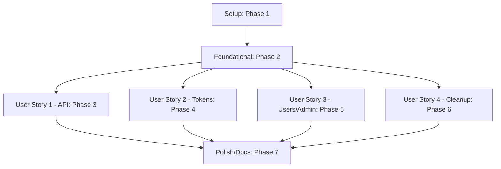

# Tasks: RFC Retrieval REST API with Personal Access Tokens & User Administration

**Input**: Design documents from `specs/002-rest-api-pat-auth/`

**Prerequisites**: [plan.md](plan.md) (required), [spec.md](spec.md) (required), [research.md](research.md), [data-model.md](data-model.md), [contracts/rest-api.md](contracts/rest-api.md), [contracts/service-contracts.md](contracts/service-contracts.md)

**Tests**: Tests are mandatory per Project Constitution (Principle IV). Implement test suites parallel to existing tests in `RfcBuddy.App.Tests` and `RfcBuddy.Web.Tests`.

**Organization**: Tasks are grouped by user story to enable independent implementation, testing, and MVP delivery of each slice.

## Format: `[ID] [P?] [Story] Description`

- **[P]**: Can run in parallel (different files, no dependencies on outstanding setup)
- **[Story]**: Which user story this task belongs to (`[US1]`, `[US2]`, `[US3]`, `[US4]`)
- Under Setup, Foundational, and Polish phases, there are no Story labels.
- File paths are included in every task description.

---

## Phase 1: Setup (Shared Infrastructure)

**Purpose**: Shared enums and type structures required by multiple modules.

- [ ] T001 Create change status enum `RfcChangeStatus.cs` in `src/RfcBuddy.App/Objects/RfcChangeStatus.cs`
- [ ] T002 [P] Create baseline scope enum `BaselineScope.cs` in `src/RfcBuddy.App/Objects/BaselineScope.cs` representing web and api baselines

---

## Phase 2: Foundational (Blocking Prerequisites)

**Purpose**: Core infrastructure for change computation, matching, and baseline persistence. No user story can begin until this phase is complete.

- [ ] T003 Create `RfcChangeTracker.cs` in `src/RfcBuddy.App/Services/RfcChangeTracker.cs` for comparing RFCs vs baseline
- [ ] T004 [P] Create unit tests for `RfcChangeTracker` in `tests/RfcBuddy.App.Tests/Services/RfcChangeTrackerTests.cs`
- [ ] T005 Modify `IUserService` and `UserService` in `src/RfcBuddy.App/Services/UserService.cs` to add baseline scope support for `ApiPreviousRFCs.txt`
- [ ] T005a [US1] Utilize local folder-scoped mutexes/file-locks for API previous rfc baseline reads and writes in `UserService.cs` instead of global locks (TASK-SEC-003)
- [ ] T006 [P] Update user service unit tests in `tests/RfcBuddy.App.Tests/Services/UserServiceTests.cs` to exercise baseline scope selection and localized user folder-specific locks
- [ ] T007 Modify `IRfcService` and `ExcelService` in `src/RfcBuddy.App/Services/ExcelService.cs` to add keyword filtering helper with ignore precedence
- [ ] T008 [P] Add unit tests for `FilterRfcs` keyword matching in `tests/RfcBuddy.App.Tests/Services/ExcelServiceTests.cs`

**Checkpoint**: Foundation ready - user story implementation and testing can now proceed.

---

## Phase 3: User Story 1 - Retrieve relevant RFCs via authenticated API (Priority: P1) 🎯 MVP

**Goal**: Implement the JSON search endpoint, custom token authentication scheme, and response mapping.

**Independent Test**: Generate a valid token, call `/api/v1/rfcs/search` with header `Authorization: Bearer <token>`, verify ignore precedence in returned JSON, and check that subsequent calls mark those items as `Unchanged` (baseline advances).

### Tests for User Story 1

- [ ] T009 [P] [US1] Create unit tests for token authentication handler in `tests/RfcBuddy.Web.Tests/Authentication/ApiTokenAuthenticationHandlerTests.cs`
- [ ] T010 [P] [US1] Create unit and integration tests for API search controller in `tests/RfcBuddy.Web.Tests/Controllers/RfcApiControllerTests.cs`

### Implementation for User Story 1

- [ ] T011 [P] [US1] Create API DTO models `RfcSearchRequest.cs`, `RfcSearchResponse.cs`, and `RfcResult.cs` in `src/RfcBuddy.Web/Models/Api/`
- [ ] T012 [US1] Implement custom scheme `ApiTokenAuthenticationHandler.cs` in `src/RfcBuddy.Web/Authentication/ApiTokenAuthenticationHandler.cs`
- [ ] T012a [P] [US1] Implement timing delay shields on authentication failures in `ApiTokenAuthenticationHandler.cs` to prevent side-channel brute-forcing (TASK-SEC-001)
- [ ] T013 [US1] Implement `RfcApiController.cs` in `src/RfcBuddy.Web/Controllers/RfcApiController.cs` integrating change tracking and filtering
- [ ] T014 [US1] Register `"ApiToken"` authentication scheme and map routes in `src/RfcBuddy.Web/Program.cs`

**Checkpoint**: Core API is functional. Downstream systems can authenticate via manual tokens and query RFCs.

---

## Phase 4: User Story 2 - Create and manage Personal Access Tokens (Priority: P1)

**Goal**: Enable logged-in users to manage (create, list, revoke) their tokens in a self-service UI.

**Independent Test**: Log in interactively, open token page, create token (expires < 90d), verify raw token is shown once, view list showing last-used, revoke token, and verify the API then rejects it with `401`.

### Tests for User Story 2

- [ ] T015 [P] [US2] Create unit tests for token service in `tests/RfcBuddy.App.Tests/Services/ApiTokenServiceTests.cs`
- [ ] T016 [P] [US2] Create unit tests for token controller in `tests/RfcBuddy.Web.Tests/Controllers/ApiTokensControllerTests.cs`

### Implementation for User Story 2

- [ ] T017 [P] [US2] Create token record domain model `ApiToken.cs` in `src/RfcBuddy.App/Objects/ApiToken.cs`
- [ ] T017a [P] [US2] Create strongly typed secret token wrappers with redacted `.ToString()` overrides to prevent diagnostic leaks (TASK-SEC-002)
- [ ] T018 [US2] Implement `IApiTokenService` and `ApiTokenService.cs` in `src/RfcBuddy.App/Services/ApiTokenService.cs` using Mutex-serialized writes to `apitokens.json` and utilizing the secret wrapper
- [ ] T019 [US2] Create MVC controller `ApiTokensController.cs` in `src/RfcBuddy.Web/Controllers/ApiTokensController.cs`
- [ ] T020 [P] [US2] Create token list and confirmation view models in `src/RfcBuddy.Web/Models/TokenListViewModel.cs`
- [ ] T021 [US2] Create token catalog index view `Index.cshtml` in `src/RfcBuddy.Web/Views/ApiTokens/`
- [ ] T022 [US2] Create token creation view `Create.cshtml` in `src/RfcBuddy.Web/Views/ApiTokens/` with single-view confirmation of raw secret

**Checkpoint**: Token management is complete. Users can create, monitor, and revoke their own tokens.

---

## Phase 5: User Story 3 - Administer users and roles (Priority: P2)

**Goal**: Track user presence, bootstrap first logged-in user as admin, promote/demote roles, list last-active, and let admins revoke any token.

**Independent Test**: Log into clean app to gain admin role automatically, promotion of second user, verify demotion of first user fails if it's the last admin, list users with last-active matching directory timestamps, and revoke another's token as admin.

### Tests for User Story 3

- [ ] T023 [P] [US3] Create unit tests for user registry service in `tests/RfcBuddy.App.Tests/Services/UserRegistryServiceTests.cs`
- [ ] T024 [P] [US3] Create unit and policy authorization tests in `tests/RfcBuddy.Web.Tests/Controllers/AdminControllerTests.cs`

### Implementation for User Story 3

- [ ] T025 [P] [US3] Create user registry domain model `UserRecord.cs` in `src/RfcBuddy.App/Objects/UserRecord.cs`
- [ ] T026 [US3] Implement `IUserRegistryService` and `UserRegistryService.cs` in `src/RfcBuddy.App/Services/UserRegistryService.cs` with Mutex-safe bootstrap and last-active filesystem resolution
- [ ] T026a [US3] Perform administrator demotion checking routines strictly nested inside active mutex locks on `users.json` to prevent de-elevation race conditions (TASK-SEC-004)
- [ ] T026b [US3] Inject structured logging audit lines `[AUDIT]` recording administrative actions and credential revocations with hashed actor references (TASK-SEC-005)
- [ ] T027 [US3] Add a global action filter or middleware in `src/RfcBuddy.Web/Support/UserRegistrationFilter.cs` to call `EnsureRegistered` on interactive logins
- [ ] T028 [US3] Register the user registry service and register the custom registration filter in `src/RfcBuddy.Web/Program.cs`
- [ ] T029 [US3] Implement `"Admin"` policy requirement and authorization handler in `src/RfcBuddy.Web/Authorization/AdminRequirement.cs`
- [ ] T030 [US3] Create administration controller `AdminController.cs` in `src/RfcBuddy.Web/Controllers/AdminController.cs` gated by `"Admin"` policy
- [ ] T031 [P] [US3] Create user list view model in `src/RfcBuddy.Web/Models/UserListViewModel.cs`
- [ ] T032 [US3] Create admin panel index view `Index.cshtml` in `src/RfcBuddy.Web/Views/Admin/`

**Checkpoint**: Administration functions are operational. System governance and auditing are fully supported.

---

## Phase 6: User Story 4 - Automatically remove inactive user data (Priority: P3)

**Goal**: Automatic periodic deletion of user directories, tokens, and records inactive for 400+ days.

**Independent Test**: Seed a user directory whose baseline files have last-write-time ≥ 400d, trigger the maintenance worker, verify the user's registry record, tokens, and storage folder are fully purged, while a user active 399 days ago is unaffected.

### Tests for User Story 4

- [ ] T033 [P] [US4] Create unit tests for user maintenance background cleanup in `tests/RfcBuddy.Web.Tests/Services/UserMaintenanceServiceTests.cs`

### Implementation for User Story 4

- [ ] T034 [US4] Implement `UserMaintenanceService.cs` in `src/RfcBuddy.Web/Services/UserMaintenanceService.cs` as a hosted background service that checks the 400-day boundary using `PreviousRFCs.txt` and `ApiPreviousRFCs.txt` file system timestamps, and cascades the deletion of matching user folders, tokens from `apitokens.json`, and records from `users.json`
- [ ] T035 [US4] Register `UserMaintenanceService` in `src/RfcBuddy.Web/Program.cs` to execute the 400-day automated cleanup periodically

**Checkpoint**: Automated user lifecycle cleanup is active. Inactive folders, files, and tokens are safely purged.

---

## Phase 7: Polish & Cross-Cutting Concerns

**Purpose**: Documentation, system hardening, and end-to-end validation.

- [ ] T036 Document public REST API usage, authentication headers, and self-service token setup in `README.md`
- [ ] T037 Perform code-style tuning and resolve compiler/analyzer warnings across all new/modified files
- [ ] T038 Run the complete validation checklist in `specs/002-rest-api-pat-auth/quickstart.md` to confirm green status

---

## Dependencies & Execution Order

### Phase Dependencies

- **Phase 1 (Setup)** can run immediately.
- **Phase 2 (Foundational)** is blocking. No User Story can be run or tested until Phase 2 is complete.
- **Phase 3 (US1)**, **Phase 4 (US2)**, **Phase 5 (US3)**, and **Phase 6 (US4)** depend on Phase 2 completion. They are independent of each other and can be implemented in parallel or sequence.
- **Phase 7 (Polish)** can be completed after all User Stories are built.

### Within Each User Story

- Unit/Integration tests MUST be written first and fail on the baseline before implementing the feature logic (TDD approach).
- Store models before writing Services.
- Services before Controller/Web handlers.
- Integrate Views last, and then run integration test suites.

### Parallel Opportunities

- All tasks with the `[P]` marker in their ID prefix (e.g. `T002`, `T004`, `T006`, etc.) have no local state dependencies and can be completed in parallel with other tasks in the same phase.
- Once Phase 2 completes, Phase 3 (US1), Phase 4 (US2), Phase 5 (US3), and Phase 6 (US4) can be split among separate developers to work in parallel.

---

## Parallel Example: User Story 1 & 2

If two developers are available once Phase 2 (Foundational) completes:

- **Developer A (User Story 1 - API Integration)**:
  - Working on `T011` creating DTO models.
  - Working on `T012` implementing custom API bearer scheme.
  - Working on `T013` creating search engine controller endpoints.
- **Developer B (User Story 2 - Token UI)**:
  - Working on `T017` creating `ApiToken` domain object.
  - Working on `T018` creating `ApiTokenService` with file writes.
  - Working on `T019`–`T022` building token generator MVC controller and views.

Both developers can merge their work into the branch, then execute their respective tests (`T009`, `T010`, `T015`, `T016`) independently.
